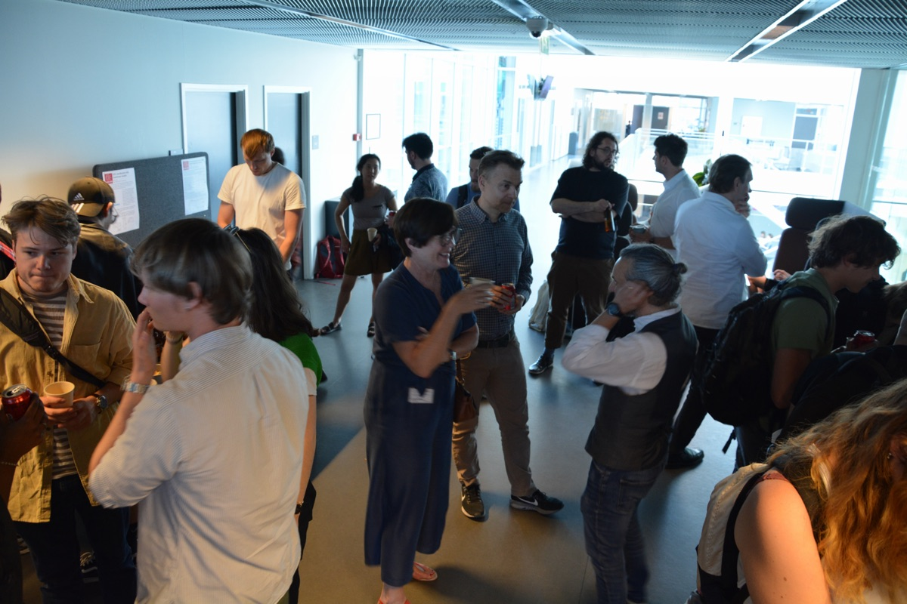
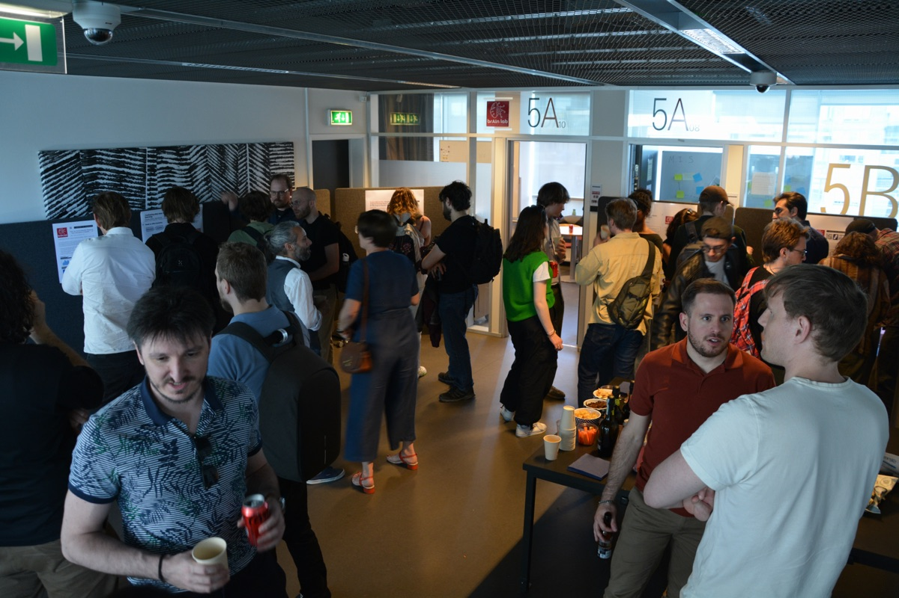
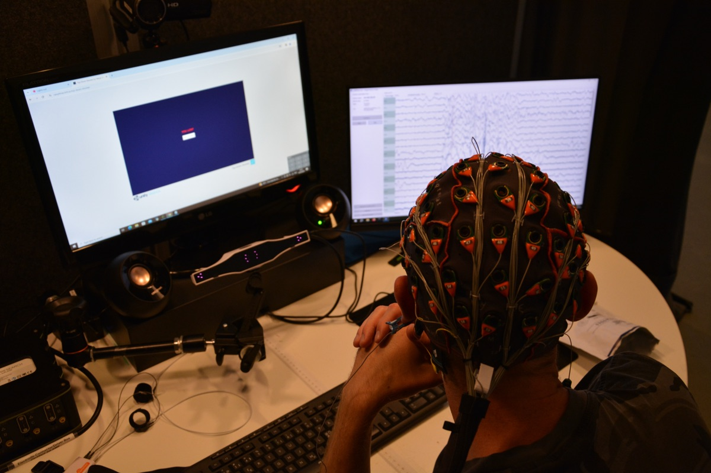

# ITU brAIn lab

Official page of the ITU brAIn lab.
Every page's text lives in a Markdown file under `content/`. There is no build
step, no bundler and no framework — one HTML shell, one stylesheet, one small
router script, and a vendored copy of [marked](https://marked.js.org/) to turn
Markdown into HTML in the browser.

## Running it

The pages are fetched with `fetch()`, so the site has to be served over HTTP —
opening `index.html` straight off disk will not work (the browser blocks
`file://` requests). Any static server does:

```bash
python3 -m http.server 8000
```

Then open <http://localhost:8000/>.

To deploy, copy the whole folder to any static host (GitHub Pages, Netlify, an
ITU web share, an S3 bucket). Nothing needs to be compiled first.

## Layout

```
index.html                 page shell: header, nav, sidebar, footer
assets/css/style.css       the whole design
assets/js/app.js           hash router + Markdown loader (~200 lines)
assets/js/marked.min.js    vendored Markdown parser (MIT)
assets/img/                logo, favicon mark, team photo
assets/img/neural-bg.svg   faint synapse texture behind the page
assets/img/people/         GENERATED — portraits and initials monograms
content/
  about.md                 "About Us"             (#/about)
  thesis.md                "Thesis Project Ideas" (#/thesis)
  people.md                "People"               (#/people)
  publications.md          "Publications"         (#/publications)
  datasets.md              "Datasets"             (#/datasets)
  news.md                  "News"                 (#/news)
  media/                   images used by the pages above
  media/news/              GENERATED — photos pulled from LinkedIn posts
  media/news/authors/      GENERATED — author pictures for the news bylines
  data/                    GENERATED — do not edit by hand
    publications.md
    datasets.md
    people.md
    news.md
scripts/update.py          refreshes content/data/ from ITU Pure and LinkedIn
scripts/make_background.py regenerates the neural background SVG
```

## The background texture

`assets/img/neural-bg.svg` is a faint neuron graph — nodes wired to their
nearest neighbours with slightly bowed connections. It is fixed to the viewport
behind the content, so it stays put while the page scrolls and never tiles, and
it is hidden when printing.

Three things move:

- **Discharges arc along the connections.** This is the effect you actually
  notice. Four things together make it read as electricity rather than as a dot
  sliding down a wire:
  - each discharge is drawn **twice** — a wide, faint halo (5px, 5%) with a
    narrower, brighter core (1.5px, 10%) on top of it, which gives a glow
    without needing an SVG blur filter;
  - the core carries a **second animation** on its own clock, guttering its
    `stroke-opacity` on an uneven 2s cycle so it does not glide at a steady
    brightness. A discharge is only lit for a second or two, so most get through
    just a step or two of that cycle — the unsteadiness is slow, not a strobe.
    The two animations coexist because they touch different properties —
    `opacity` for the dart, `stroke-opacity` for the flicker — so neither
    overwrites the other;
  - a connection is only lit for **30% of its cycle** (`SIGNAL_DART`) and dark
    the rest, so the network fires in bursts rather than running like a conveyor
    belt. Roughly 10 of the 37 are lit at any moment;
  - the flicker period is deliberately **not a factor of** the dart period, so a
    given connection never strobes the same way twice.

  Each path carries `pathLength="100"`, which normalises paths of different real
  lengths so a single `stroke-dashoffset` keyframe drives all of them.
- **Neurons pulse** between 25% and full strength over 5–11s.
- **The whole graph drifts** 8px over 90 seconds.

Every animated element gets a random negative animation delay, so nothing moves
in unison and the page never opens on a synchronised flash. Under
`prefers-reduced-motion: reduce` the discharges are hidden outright rather than
frozen mid-connection, and the graph itself stops moving.

A note if you tune this: the node pulse on its own is not perceptible. The nodes
rest at around 7% opacity, so pulsing them still only swings between roughly
0.02 and 0.07 alpha on white — real, measurable, and invisible. The discharges
read because the core is drawn at a couple of times the opacity of the resting
connections underneath it *and* because it moves; opacity alone is not what
makes them visible.

**Why app.js injects it instead of using `background-image`:** browsers freeze
CSS animations inside an SVG that is used as a CSS background — the image
renders, but permanently at frame 0. The animation only runs when the SVG is
inline in the DOM, so `mountBackground()` fetches the file and drops it into
`<div class="neural-bg">`. It is decorative, so if that fetch fails the page
carries on without it.

The SVG is committed, so nothing needs to run for the site to work. The dials
are near the top of `scripts/make_background.py`:

| Setting | Controls |
|---|---|
| `EDGE_OPACITY`, `NODE_OPACITY` | how visible the resting graph is |
| `SIGNAL_SHARE` | how many connections carry a discharge |
| `SIGNAL_MIN`, `SIGNAL_MAX` | seconds for one fire-and-rest cycle |
| `SIGNAL_DART` | fraction of that cycle spent lit — lower means rarer, snappier bursts |
| `CORE_*`, `HALO_*` | width, length and opacity of the bolt and its glow |
| `FLICKER_SECONDS` | how fast the core gutters |
| `SIGNAL_ACCENT_SHARE` | how many discharges run red rather than black |
| `FIRING_SHARE`, `PULSE_MIN`, `PULSE_MAX`, `PULSE_DIM` | the node pulse |
| `DRIFT_SECONDS`, `DRIFT_PX` | the slow drift of the whole graph |

Set `SIGNAL_SHARE = 0` and `FIRING_SHARE = 0` for a completely static image.
Re-run after editing:

```bash
python3 scripts/make_background.py
```

The random seed is fixed, so the same settings always redraw the same picture.

## Editing content

Edit the Markdown in `content/` and reload the page. Each file starts with a
small front-matter block:

```markdown
---
title: About Us
sidebar: news
---
```

- `title` — the `<h1>` and the browser tab title.
- `sidebar` — `news` shows the News widget beside the content, anything else
  (or omitting it) gives a full-width page.

A page can pull in another Markdown file with an include directive:

```markdown
{{include: content/data/publications.md}}
```

The included file is rendered separately and wrapped in a `.record-list`
container, which is how the Pure-generated lists get their own styling without
affecting the surrounding prose.

### Images

Put image files in `content/media/` and reference them from the page root, the
way the pages are served:

```markdown

```

Keep images local rather than hotlinking. The site is self-contained by design,
and the pages that came across from the old WordPress site originally pointed at
`brainlab.itu.dk` uploads — those copies now live here.

Several images on consecutive lines, with no blank line between them, become a
responsive gallery grid:

```markdown



```

That is one Markdown paragraph, so the images end up as siblings in a single
`<p>`, which the stylesheet turns into a grid (`p:has(img + img)`). A blank line
between them instead gives you separate full-width images. Content images are
lazy-loaded, so a long gallery does not hold up the rest of the page.

Photos straight off a camera are far too big to commit — the eight lab-opening
originals were 18MB. Resize before adding, e.g. `sips -Z 1200 -s format jpeg
-s formatOptions 80 original.JPG --out content/media/name.jpg`. Around 1200px is
a good target: comfortably sharp in the lightbox without bloating the repo.

Content images open full size in a lightbox when clicked. Images in the same
gallery paragraph can be paged through with the on-screen arrows or the left and
right arrow keys; Escape, the close button or a click on the backdrop dismisses
it. An image's alt text, if it has any, becomes the caption. Portraits in the
people list are deliberately excluded — they are only 320px, so enlarging them
would just show a blurry crop.

### Embedding a video

Put a YouTube or Vimeo link **alone on its own line** and it becomes a player:

```markdown
[Watch the video](https://youtu.be/XDGEcByv-N0)
```

A link inside a sentence is left as a link — only a paragraph that contains
nothing but the link is converted, so prose that happens to cite a video is not
disturbed. `embedVideos()` in `app.js` does the swap after Markdown rendering;
there is no special syntax to learn and the Markdown still reads fine as text.

Recognised: `youtu.be/ID`, `youtube.com/watch?v=ID`, `/embed/`, `/shorts/`, and
`vimeo.com/ID`. A `?t=` start time is carried over (`90` or `1m30s` both work).
YouTube embeds use `youtube-nocookie.com` so viewers are not tracked before they
press play. Players are 16:9 and capped at 760px wide.

### Adding a page

1. Create `content/yourpage.md` with front matter.
2. Add a line to `ROUTES` in `assets/js/app.js`.
3. Add a `<li><a href="#/yourpage">…</a></li>` to the nav in `index.html`.
   The desktop nav needs about 887px for its six items and switches to the
   mobile menu at 940px, so there is little room for another one before that
   breakpoint needs raising.

### Adding news

Recent news comes from LinkedIn — see *News from LinkedIn* below — and
`content/news.md` includes it above the older entries kept by hand. To add an
entry by hand, append a `## Title` section to `content/news.md` with the date
on the next line as `*April 10, 2025*`. The sidebar widget picks up the five
most recent entries from the page, generated ones included, and links to them.

Each row in that widget shows the author's picture next to the title, taken
from the entry's byline. A hand-written entry has no byline, so it falls back to
the lab's own mark (`assets/img/mark.png`) rather than leaving a hole in the
column — the same reasoning as the monograms on the people page.

## Updating publications, datasets, people and news

```bash
python3 scripts/update.py
```

Standard library only — no `pip install`. It reads three RSS feeds from ITU's
Pure portal plus the lab's LinkedIn page, and rewrites the four files in
`content/data/`:

| File | Source |
|---|---|
| `content/data/publications.md` | `pure.itu.dk/en/organisations/brain-lab/publications/?format=rss` |
| `content/data/datasets.md` | `pure.itu.dk/en/organisations/brain-lab/datasets/?format=rss` |
| `content/data/people.md` | `pure.itu.dk/en/organisations/brain-lab/persons/?format=rss` |
| `content/data/news.md` | `linkedin.com/company/itu-brain-lab` |

Options:

```bash
python3 scripts/update.py --dry-run          # show what would change
python3 scripts/update.py publications       # one source only
python3 scripts/update.py --lang da          # Danish Pure portal instead of English
python3 scripts/update.py --no-photos        # skip fetching portraits and post photos
python3 scripts/update.py --linkedin-url URL # read the news from another company page
```

Publications are grouped by year. Email addresses on the people list come out
of Pure's base64 obfuscation and are written as ordinary `mailto:` links.

## News from LinkedIn

LinkedIn publishes no feed for a company page, so `update.py` reads the page
itself. Logged-out visitors are shown the five most recent updates, and those
five are what ends up in `content/data/news.md` — running the script more often
does not reach further back, so anything older is worth copying into the
hand-written part of `content/news.md` before it falls off.

A post has no title, so the heading is made from its opening line (truncated at
88 characters). Where the line becomes the heading whole, it is dropped from the
body rather than printed twice. The date is not the "2mo" the page displays: a
LinkedIn activity id carries its creation time in its top 41 bits, which is
recovered and formatted as a real date.

### Reposts

The lab's page is mostly reposts, and LinkedIn has two kinds that need opposite
treatment:

- A **pure repost** — "ITU brAIn lab reposted this", nothing added — is rendered
  by LinkedIn as the original post itself: the byline is the original author and
  the body is their words. The script keeps that original as the news entry, and
  credits, dates and links it via `data-featured-activity-urn`, so the entry
  points at the post being repeated rather than at the lab's empty repost of it.
- A **repost with commentary** keeps the lab's own words at the top; the post it
  quotes is nested in an inner `<article>` and is carried through underneath as
  a blockquote with its own byline.

Links are unwrapped on the way out: `/redir/redirect` hops and `lnkd.in`
shortlinks are resolved to the page they point at, LinkedIn's `trk=` tracking
parameter is dropped, and hashtags and mentions that only lead to a sign-up wall
keep their text and lose their link. Photos attached to a post are downloaded to
`content/media/news/`, named after the activity id, for the same reason as the
portraits below — no hotlinking a host we do not own.

### Author pictures

Each entry closes with the author's picture next to *Posted by …*, and a quoted
repost carries the picture of whoever wrote the post being quoted. Those are
downloaded to `content/media/news/authors/` and named after the author rather
than the post — `burelli.jpg`, `itu-brain-lab.jpg` — so the several entries that
share an author share one file. A person's photo arrives at 400px and an
organisation's logo at 100px; both are rendered at 34px and masked to a circle.

An author with no picture on LinkedIn, or whose picture will not download, gets
the same initials monogram the people page uses, so no byline is left with a
gap. `--no-photos` gives every author a monogram; `--dry-run` writes no image
files at all.

The generated Markdown puts the picture on the line directly above the credit,
inside the same paragraph. That is deliberate: it makes the byline avatar the
one image with *text* rather than another image as its next sibling, which is
how `style.css` finds it to make it round, how `app.js` knows to leave it out of
the lightbox, and how `parseNews()` picks it up for the sidebar widget. Move it
and all three stop matching.

The parsing leans on LinkedIn's `data-test-id` attributes, which LinkedIn
changes without notice. If a run reports no updates found, or entries come out
empty, that markup has moved: start at `split_updates()` and `card_body()` in
`scripts/update.py`.

### Portraits

The person feed carries no images, so the script also fetches each person's Pure
page, pulls the portrait out of it, and saves it to `assets/img/people/`. The
site therefore serves its own copies rather than hotlinking `pure.itu.dk` on
every page view.

Most people have no portrait uploaded to Pure — at the time of writing only two
of eight do. Everyone else gets a generated initials monogram (an SVG in the
same folder) so the contacts list stays visually even instead of mixing photos
with ragged text-only rows. Upload a portrait to Pure and the next run replaces
that person's monogram with the real thing.

Filenames are folded to plain ASCII: Pure slugs can contain non-ASCII characters
(`morten-ib-kj%C3%A6rgaard-munk`), and keeping those in filenames means URL
escaping plus a macOS/Linux Unicode-normalisation mismatch waiting to happen.

`--no-photos` skips the portrait fetch — it costs one extra request per person —
and gives everybody a monogram. `--dry-run` writes no image files at all.

### Who counts as a lab coordinator

The people list is split into **Lab Coordinators** and **Lab Members**. The
coordinators are named in the `COORDINATORS` constant at the top of
`scripts/update.py`:

```python
COORDINATORS = [
    {"slug": "stefan-heinrich", "name": "Stefan Heinrich"},
    {"slug": "paolo-burelli",   "name": "Paolo Burelli"},
]
```

Each entry matches on the Pure person-page slug first and falls back to the
display name, so neither a renamed slug nor a changed display name silently
drops someone into Lab Members. Coordinators appear in the order listed above;
everyone else keeps the order Pure returned. A group whose people are all absent
from the feed is omitted rather than left as an empty heading — so if Pure stops
listing both coordinators, the page is simply a Lab Members list.

To change who is a coordinator, edit that constant and re-run the script.

## Notes

- `assets/js/marked.min.js` is the only third-party file. Replacing it means
  swapping one `<script>` tag.
